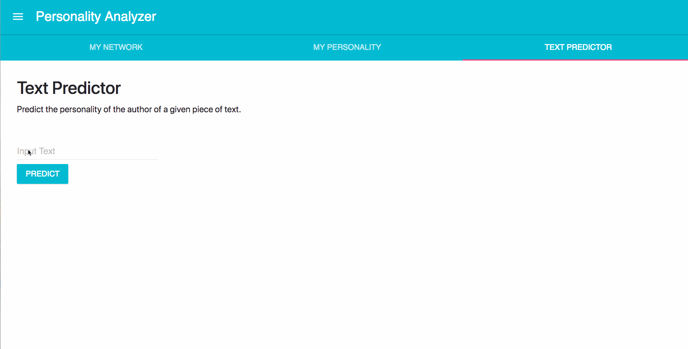
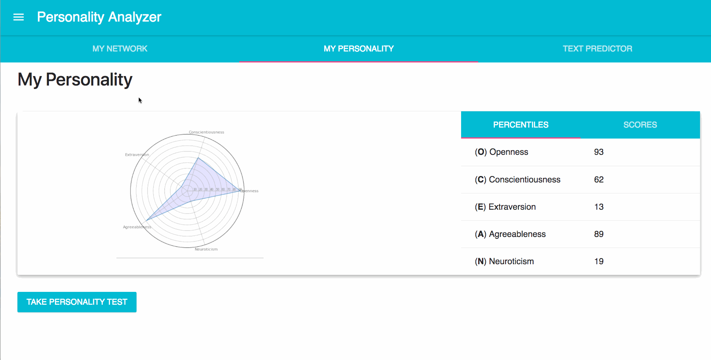

# Personality Prediction from Text

This project aims to predict Big 5 personality traits from a sample of text using various Machine Learning models. A Facebook webscraper is included to scrape statuses of your Facebook friends to create a personality prediction for each of them. A Web App, Personality Analyzer, was created to interface with the predictions to compare your personality to your friends directly.

---

# Requirements 

Python, MongoDB, PyMongo, Node.js/npm, Selenium

---

# Installation and Usage

## Webscrape Facebook

The webscraper is located in fb_webscraper.py.
The scraper requires your login credentials and profile url to be in the yaml file fb_login_creds.yaml.

Run the webscraper: 

python fb_webscraper.py

This will open a Selenium automated browser that will login to your Facebook account and create a list of your friends and their profile urls, and then visit each friend's timeline and scrape 50 statuses and add them to a MongoDB.

## Train the Models

The models file is located in model.py

Run and train the models:

python model.py

This trains the models on the myPersonalty status data and creates five pickle files corresponding to each personality trait in the static folder.

## Make Predictions

The prediction file is located in predict.py

Run the prediction file:

python predict.py

This will create personality predictions for the current Facebook statuses in your database.

## Web App

Install the web app:

npm install

This installs the required node modules to run the web app.

Bundle javascript:

npm run build

Creates the javascript bundle.

Run the web app:

python app.py

This runs the web app on the local environment.
Visit localhost:5000 to view the web app.

---

# About
## Introduction

### Personality

Personality is an important aspect of human life and is important for understanding yourself and other people. The preeminent personality model in personality psychology is the Big 5 model (https://en.wikipedia.org/wiki/Big_Five_personality_traits). The Big 5 model was derived through factor analysis of questions based on common descriptive adjectives. This analysis produced five distinct traits of personality:

#### Big 5 Traits (O. C. E. A. N.)
##### (O) Openness to experience:
(inventive/curious vs. consistent/cautious)

Appreciation for art, emotion, adventure, unusual ideas, curiosity, and variety of experience. Openness reflects the degree of intellectual curiosity, creativity and a preference for novelty and variety a person has. It is also described as the extent to which a person is imaginative or independent and depicts a personal preference for a variety of activities over a strict routine. High openness can be perceived as unpredictability or lack of focus, and more likely to engage in risky behaviour or drug taking. Also, individuals that have high openness tend to lean towards being artists or writers in regards to being creative and appreciate of the significance of the intellectual and artistic pursuits. Moreover, individuals with high openness are said to pursue self-actualization specifically by seeking out intense, euphoric experiences. Conversely, those with low openness seek to gain fulfillment through perseverance and are characterized as pragmatic and data-driven—sometimes even perceived to be dogmatic and closed-minded. Some disagreement remains about how to interpret and contextualize the openness factor.

#### (C) Conscientiousness:
(efficient/organized vs. easy-going/careless)

A tendency to be organized and dependable, show self-discipline, act dutifully, aim for achievement, and prefer planned rather than spontaneous behavior. High conscientiousness is often perceived as stubbornness and obsession. Low conscientiousness is associated with flexibility and spontaneity, but can also appear as sloppiness and lack of reliability.

#### (E) Extraversion:
(outgoing/energetic vs. solitary/reserved)

Energy, positive emotions, surgency, assertiveness, sociability and the tendency to seek stimulation in the company of others, and talkativeness. High extraversion is often perceived as attention-seeking and domineering. Low extraversion causes a reserved, reflective personality, which can be perceived as aloof or self-absorbed. Extroverted people tend to be more dominant in social settings, opposed to introverted people who may act more shy and reserved in this setting.

#### (A) Agreeableness:
(friendly/compassionate vs. challenging/detached)

A tendency to be compassionate and cooperative rather than suspicious and antagonistic towards others. It is also a measure of one's trusting and helpful nature, and whether a person is generally well-tempered or not. High agreeableness is often seen as naive or submissive. Low agreeableness personalities are often competitive or challenging people, which can be seen as argumentative or untrustworthy.

#### (N) Neuroticism:
(sensitive/nervous vs. secure/confident)

Neuroticism identifies certain people who are more prone to psychological stress. The tendency to experience unpleasant emotions easily, such as anger, anxiety, depression, and vulnerability. Neuroticism also refers to the degree of emotional stability and impulse control and is sometimes referred to by its low pole, "emotional stability". A high stability manifests itself as a stable and calm personality, but can be seen as uninspiring and unconcerned. A low stability expresses as a reactive and excitable personality, often very dynamic individuals, but they can be perceived as unstable or insecure. It has also been researched that individuals with higher levels of tested neuroticism tend to have worse psychological well being.

## Methods

### Machine Learning

The models used are a Random Forest Regressor and a Random Forest Classifier. The models are trained on a dataset from the myPersonality project (https://sites.google.com/michalkosinski.com/mypersonality). Models produce a predicted personality score, using the regression model, and a probability of the binary class, using the classification model, for each personality trait.

### Web App

The Web App was created using React.js using the Material-UI frontend library and Webpack for bundling. The backend is using Flask and MongoDB.

There are three sections of the Web App:

#### Text Predictor

The Text Predictor tab allows you to input any text and create a corresponding personality prediction.

#### My Personality

The My Personality tab allows you take a 50 question Big 5 personality test (Goldberg, Lewis R. "The development of markers for the Big-Five factor structure." Psychological assessment 4.1 (1992): 26. <http://dx.doi.org/10.1037/1040-3590.4.1.26>) which then displays your corresponding personality radar graph and percentile scores.

#### My Network

The My Network tab lists out the personality predictions for the scraped statuses for each of your friends in your Facebook network. A compare function allows you to compare your personality score taken from the My Personality tab and the personality prediction created from the models. An overlay of the compared personality radar plots is created for visual representation of personality differences.

